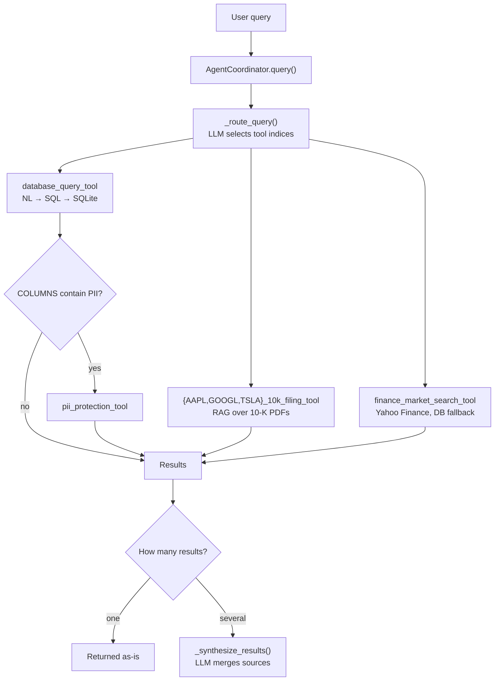
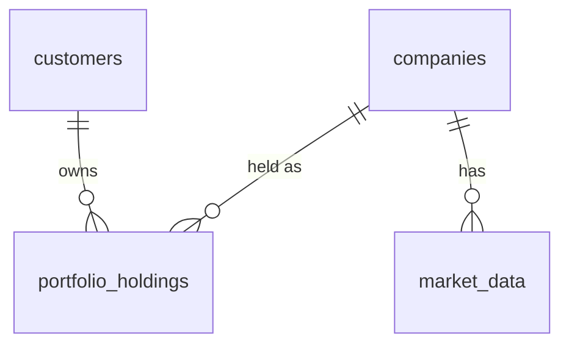

# Course 3 — Financial Multi-Tool Agent

An LLM-routed agent that answers financial questions using six tools across three data sources: SEC 10-K filings, a SQLite portfolio database and the Yahoo Finance API. Customer PII in database results is masked automatically.

Code: [`starter-code/starter_code/`](starter-code/starter_code/) · Walkthrough: [`financial_agent_walkthrough.ipynb`](starter-code/starter_code/financial_agent_walkthrough.ipynb)

## Architecture



| Module | Responsibility |
|---|---|
| `helper_modules/document_tools.py` | Load each 10-K PDF, chunk (1024/100), embed, one `QueryEngineTool` per company |
| `helper_modules/function_tools.py` | Database (NL→SQL, one retry with the error as context), market data, PII masking as `FunctionTool`s |
| `helper_modules/agent_coordinator.py` | Configure models, build tools, route, coordinate PII, synthesize |

All modules use **gpt-3.5-turbo** and **text-embedding-ada-002** with Vocareum's `api_base` (`OPENAI_API_BASE`), as the rubric requires.

## Implementation choices

- **Routing** is a single LLM call that returns tool indices. The PII tool is never routed; the coordinator applies it.
- **PII trigger:** the database tool ends every result with `COLUMNS: [...]`. The coordinator masks the result only when those columns include `name`, `email`, `phone`, `address` or `ssn`.
- **Masking:** email → `***@domain.com`, phone → `***-***-1234`, SSN → `***-**-****`, address → `*** [address masked] ***`, names → `****`. Dict rows are masked by column. Free text is masked by pattern. A notice lists the masked fields.
- **Market data** falls back to the latest stored close in `market_data` when Yahoo is unreachable or rate-limited. The output labels the source.
- **Paths** resolve from `__file__`, and `course-3/.env` loads automatically, so the code runs from any working directory.

## Database (`data/financial.db`)



Seed data: 10 customers, 3 companies, 23 holdings, 90 market rows. Schema details are in `DB_SCHEMA` in `function_tools.py`.

## Running

```bash
# from course-3/
uv venv .venv && uv pip install --python .venv -r starter-code/starter_code/requirements.txt pytest
cp .env.template .env   # set OPENAI_API_KEY and OPENAI_API_BASE

# from course-3/starter-code/starter_code/
../../.venv/bin/python data/build_database.py
../../.venv/bin/python -m pytest tests/test_e2e.py
../../.venv/bin/jupyter nbconvert --to notebook --execute --inplace financial_agent_walkthrough.ipynb
```
