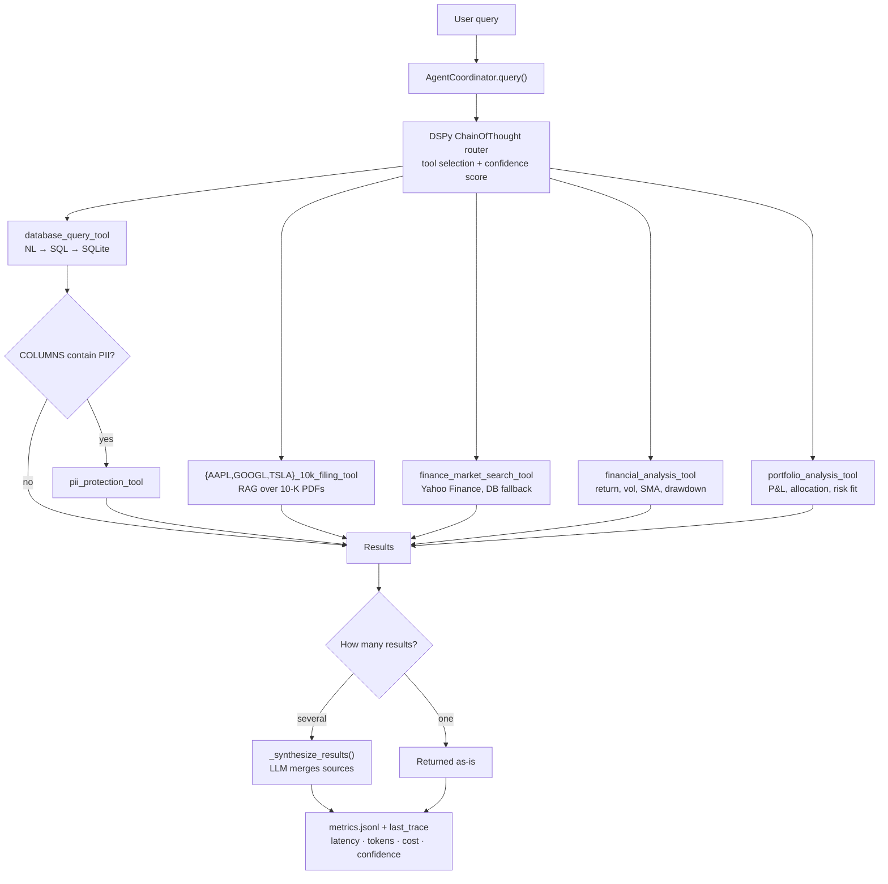
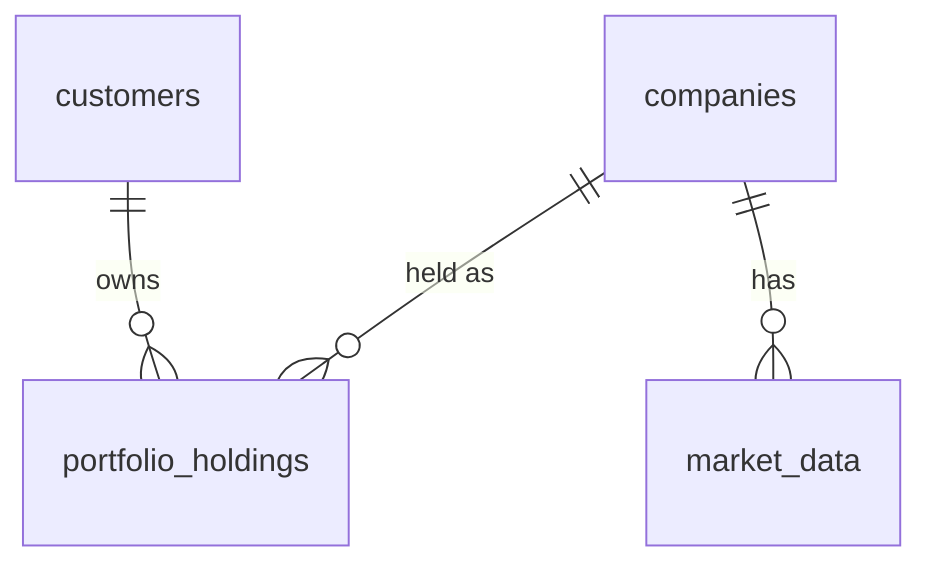

# Course 3 — Financial Multi-Tool Agent

An LLM-routed agent that answers financial questions using six tools across three data sources: SEC 10-K filings, a SQLite portfolio database and the Yahoo Finance API. Customer PII in database results is masked automatically.

Code: [`starter-code/starter_code/`](starter-code/starter_code/) · Walkthrough: [`financial_agent_walkthrough.ipynb`](starter-code/starter_code/financial_agent_walkthrough.ipynb)

## Architecture



| Module | Responsibility |
|---|---|
| `helper_modules/document_tools.py` | Load each 10-K PDF, chunk (1024/100), embed, one `QueryEngineTool` per company |
| `helper_modules/function_tools.py` | Database (NL→SQL, one retry with the error as context), market data, PII masking as `FunctionTool`s |
| `helper_modules/agent_coordinator.py` | Build tools, route, coordinate PII, synthesize, record metrics |
| `helper_modules/router.py` | DSPy router: few-shot demos, confidence score, feedback loop |
| `helper_modules/models.py` | Load `config.toml`, pick the provider, configure LlamaIndex and DSPy |

All modules use **gpt-3.5-turbo** and **text-embedding-ada-002**. The active provider is selected at startup from `config.toml`'s `provider_order`: Vocareum is tried first; if its key is absent or unresponsive, OpenRouter is used with `openai/gpt-3.5-turbo` and `mistralai/mistral-embed-2312` (OpenRouter serves `ada-002` only through a bring-your-own OpenAI key). The rubric environment (Vocareum) therefore works unchanged, while a local `.env` with `OPENROUTER_API_KEY` provides a drop-in fallback.

## Implementation choices

- **Routing** is a DSPy `ChainOfThought` module with few-shot demos from `config.toml`. It returns tool names and a confidence score (0–1). The PII tool is never routed; the coordinator applies it automatically.
- **PII trigger:** the database tool ends every result with `COLUMNS: [...]`. The coordinator masks the result only when those columns include `name`, `email`, `phone`, `address` or `ssn`.
- **Masking:** email → `***@domain.com`, phone → `***-***-1234`, SSN → `***-**-****`, address → `*** [address masked] ***`, names → `****`. Dict rows are masked by column. Free text is masked by pattern. A notice lists the masked fields.
- **Market data** falls back to the latest stored close in `market_data` when Yahoo is unreachable or rate-limited. The output labels the source.
- **Paths** resolve from `__file__`, and `course-3/.env` loads automatically, so the code runs from any working directory.

## Extras

| Extra | What it does | Where |
|---|---|---|
| Configuration management | All model, provider, pricing, chunking and routing settings in one place; edit without touching code | `config.toml` |
| Multi-model with fallback | Probes Vocareum first; falls back to OpenRouter (`openai/gpt-3.5-turbo`, Mistral embeddings) if Vocareum is absent or expired | `helper_modules/models.py` · `config.toml` |
| Financial analysis | Period return, annualised volatility, 20/50-day SMA, trend and max drawdown per symbol | `helper_modules/function_tools.py` |
| Portfolio analysis | Cost basis, market value, unrealised P&L, allocation weights, concentration and risk-fit by customer id (no PII) | `helper_modules/function_tools.py` |
| Confidence scoring | Router emits a score; answers below 0.6 get a one-line low-confidence notice | `helper_modules/router.py` |
| Monitoring / observability | `coordinator.last_trace` and `coordinator.metrics_summary()` expose latency, tokens, cost and tool usage; traces append to `runtime/metrics.jsonl` | `helper_modules/agent_coordinator.py` |
| Prompt engineering | Few-shot routing examples in `config.toml` + structured synthesis prompt keep answers grounded | `config.toml` · `helper_modules/agent_coordinator.py` |
| Tool learning (DSPy feedback loop) | `coordinator.feedback()` records labelled examples; `coordinator.optimize_router()` compiles a better router and saves it to `runtime/router.json` | `helper_modules/router.py` |

Error handling (SQL retry, market data fallback) and Yahoo Finance market data were already part of the base implementation. Regulatory compliance was left out on purpose.

## Database (`data/financial.db`)



Seed data: 10 customers, 3 companies, 23 holdings, 90 market rows. Schema details are in `DB_SCHEMA` in `function_tools.py`.

## Running

```bash
# from course-3/
uv venv .venv && uv pip install --python .venv -r starter-code/starter_code/requirements.txt pytest
cp .env.template .env
# Set OPENAI_API_KEY + OPENAI_API_BASE for Vocareum (primary).
# Optionally set OPENROUTER_API_KEY for the OpenRouter fallback.

# from course-3/starter-code/starter_code/
../../.venv/bin/python data/build_database.py
../../.venv/bin/python -m pytest tests/test_e2e.py
../../.venv/bin/jupyter nbconvert --to notebook --execute --inplace financial_agent_walkthrough.ipynb
```
